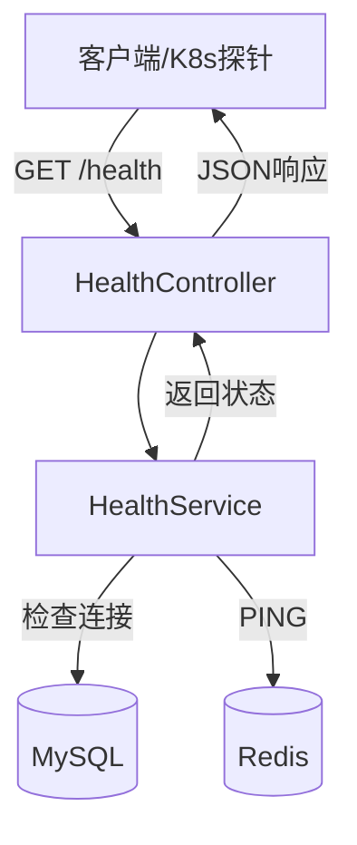

# 设计文档

## 概述

本设计文档描述健康检查接口的技术实现方案。该接口将作为 Yii2 RESTful API 的一部分，提供服务健康状态监控功能，支持 Docker/Kubernetes 健康探针集成。

## 架构

### 整体架构



### 组件职责

1. **HealthController**: 处理 HTTP 请求，返回健康状态响应
2. **HealthService**: 执行各项健康检查，聚合检查结果
3. **数据库检查**: 验证 MySQL 连接可用性
4. **Redis 检查**: 验证 Redis 连接可用性

## 组件与接口

### HealthController

位置：`app/controllers/HealthController.php`

```php
class HealthController extends Controller
{
    /**
     * 禁用认证，允许公开访问
     */
    public function behaviors(): array
    
    /**
     * GET /health
     * 返回服务健康状态
     */
    public function actionIndex(): array
}
```

**设计决策**：
- 控制器放在根 `controllers` 目录而非 `v1/v2` 模块中，因为健康检查是基础设施级别的功能，不属于业务 API 版本
- 通过覆盖 `behaviors()` 方法禁用认证

### HealthService

位置：`app/components/HealthService.php`

```php
class HealthService extends Component
{
    /**
     * 执行所有健康检查
     * @return array 健康状态结果
     */
    public function check(): array
    
    /**
     * 检查数据库连接
     * @return array 检查结果
     */
    protected function checkDatabase(): array
    
    /**
     * 检查 Redis 连接
     * @return array 检查结果
     */
    protected function checkRedis(): array
}
```

**设计决策**：
- 作为 Yii2 组件实现，便于依赖注入和测试
- 各检查方法独立，便于扩展新的依赖检查

## 数据模型

### 健康状态响应结构

```json
{
    "status": "healthy",
    "timestamp": "2024-01-15T10:30:00+08:00",
    "checks": {
        "database": {
            "status": "up",
            "responseTime": 5
        },
        "redis": {
            "status": "up",
            "responseTime": 2
        }
    }
}
```

### 异常状态响应结构

```json
{
    "status": "unhealthy",
    "timestamp": "2024-01-15T10:30:00+08:00",
    "checks": {
        "database": {
            "status": "down",
            "responseTime": 5001,
            "error": "Connection timed out"
        },
        "redis": {
            "status": "up",
            "responseTime": 2
        }
    }
}
```

### 字段说明

| 字段 | 类型 | 说明 |
|------|------|------|
| status | string | 整体状态：`healthy` 或 `unhealthy` |
| timestamp | string | ISO 8601 格式的检查时间 |
| checks | object | 各依赖服务的检查结果 |
| checks.*.status | string | 单项状态：`up` 或 `down` |
| checks.*.responseTime | int | 响应时间（毫秒） |
| checks.*.error | string | 错误信息（仅失败时） |

## 路由配置

在 `web.php` 中添加路由规则：

```php
'urlManager' => [
    'rules' => [
        'GET health' => 'health/index',
        // ... 其他规则
    ],
],
```


## 正确性属性

*正确性属性是一种应该在系统所有有效执行中保持为真的特征或行为——本质上是关于系统应该做什么的形式化陈述。属性作为人类可读规范和机器可验证正确性保证之间的桥梁。*

### Property 1: 健康状态聚合正确性

*对于任意* 依赖检查结果集合，当所有检查的 status 都为 "up" 时，整体 status 应为 "healthy"；当任一检查的 status 为 "down" 时，整体 status 应为 "unhealthy"。

**Validates: Requirements 1.3, 1.4**

### Property 2: 响应格式完整性

*对于任意* 健康检查响应，序列化后的 JSON 必须包含 `status`（字符串）、`timestamp`（ISO 8601 格式字符串）和 `checks`（对象）字段。

**Validates: Requirements 1.2, 5.1**

### Property 3: 依赖检查结果格式正确性

*对于任意* 单项依赖检查结果：
- 必须包含 `status` 字段，值为 "up" 或 "down"
- 必须包含 `responseTime` 字段，值为非负整数（毫秒）
- 当 status 为 "down" 时，必须包含 `error` 字段描述错误原因

**Validates: Requirements 2.2, 2.3, 3.2, 3.3, 5.2, 5.3**

## 错误处理

### 数据库连接错误

| 错误场景 | 处理方式 |
|---------|---------|
| 连接超时（>5秒） | 返回 status: "down"，error: "Connection timed out" |
| 认证失败 | 返回 status: "down"，error: "Authentication failed" |
| 数据库不存在 | 返回 status: "down"，error: "Database not found" |
| 网络不可达 | 返回 status: "down"，error: "Network unreachable" |

### Redis 连接错误

| 错误场景 | 处理方式 |
|---------|---------|
| 连接超时（>3秒） | 返回 status: "down"，error: "Connection timed out" |
| 认证失败 | 返回 status: "down"，error: "Authentication failed" |
| 服务不可用 | 返回 status: "down"，error: "Service unavailable" |

### HTTP 响应码

| 场景 | HTTP 状态码 |
|-----|------------|
| 所有检查通过 | 200 OK |
| 任一检查失败 | 503 Service Unavailable |

## 测试策略

### 单元测试

单元测试用于验证具体示例和边界情况：

1. **HealthService 测试**
   - 测试数据库连接成功时返回正确格式
   - 测试数据库连接失败时返回错误信息
   - 测试 Redis 连接成功时返回正确格式
   - 测试 Redis 连接失败时返回错误信息

2. **HealthController 测试**
   - 测试无认证访问是否允许
   - 测试响应 Content-Type 是否正确

### 属性测试

属性测试用于验证跨所有输入的通用属性。使用 PHPUnit 配合数据提供器模拟属性测试：

1. **健康状态聚合测试**
   - 生成各种检查结果组合
   - 验证聚合逻辑正确性
   - 最少 100 次迭代

2. **响应格式测试**
   - 生成随机健康状态数据
   - 验证序列化后包含所有必需字段

3. **依赖检查格式测试**
   - 生成成功和失败的检查结果
   - 验证字段完整性和值的正确性

### 测试配置

- 属性测试库：PHPUnit DataProvider（PHP 生态中的属性测试方案）
- 每个属性测试最少运行 100 次迭代
- 测试标签格式：`@group health-check, Property N: {property_text}`
